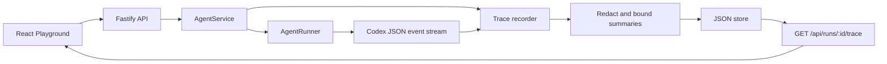

# Glass Box: Trace and Audit Architecture

## Goal

Glass Box makes every Agent Run diagnosable without changing the existing
Playground lifecycle. A trace correlates platform lifecycle, Codex CLI JSON
events, usage, failures, cancellation, and bounded human-readable evidence.

## Data flow and trust boundary

The browser never receives the Ark key. Raw Codex events exist only while the
runner parses stdout; only redacted, bounded summaries are persisted and
returned by the trace API.

## Trace contract

Each `AgentRun` owns a stable `traceId`. A `RunTrace` contains ordered events
with a trace ID, Run ID, Agent ID, sequence, type, status, timestamp, and
summary. Important event types include `run.queued`, `run.started`,
`codex.*`, `runtime.failed`, `runtime.timeout`, `runtime.cancelled`, and final
Run status events.

The runner receives the Run ID and emits structured events through an optional
callback. This keeps `CodexRunner` and `ContainerCodexRunner` interchangeable.
`AgentService` owns lifecycle events and writes the completed trace atomically
with the existing JSON store.

## Redaction and retention

- Keys such as authorization, cookie, password, secret, token, and API key are
  masked before storage.
- Credential-like strings are masked before storage and display.
- Each summary is truncated and each trace retains a bounded event count.
- This POC uses a single local JSON store; it is not a distributed trace system
  and should not be used with production secrets or sensitive data.

## API and UI

- `GET /api/runs/:id/trace` returns the trace and ordered events for a Run.
- The Playground’s **Run evidence** panel shows the trace ID, final status,
  available token usage, and timeline.
- `POST /api/agents/:id/trace-demo/failure` is available only when
  `TRACE_DEMO_ENABLED=true` outside production. It records a deterministic,
  clearly labelled backend failure fixture; it never invokes the model or a
  Runtime action.

## Demo script

1. Start the POC with a configured Ark endpoint and `TRACE_DEMO_ENABLED=true`.
2. Create or select an Agent and complete a real Playground task that reads,
   writes, or runs a workspace action.
3. Open **Run evidence** and identify lifecycle, Codex, usage, and completion
   events.
4. Select **Run controlled failure**. Show the failed Run and its focused
   `fixture.failure` event; explain that no protected action ran.
5. Start the Agent again and run a safe task to demonstrate recovery.

## Verification and limitations

Tests cover redaction, event ordering, normal Run evidence, runner event
parsing, cancellation/output/runtime error paths, and existing lifecycle
behavior. The implementation does not provide trace search/export, external
telemetry, cross-process guarantees, or a hardened sandbox policy.
