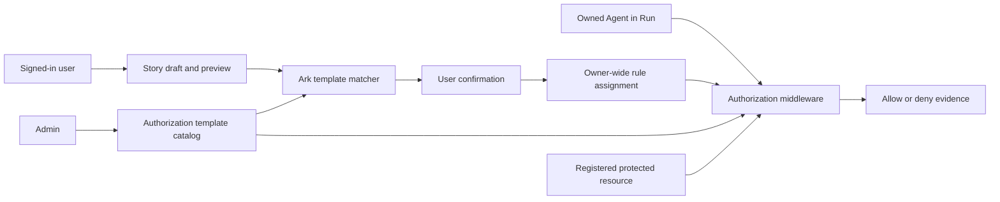
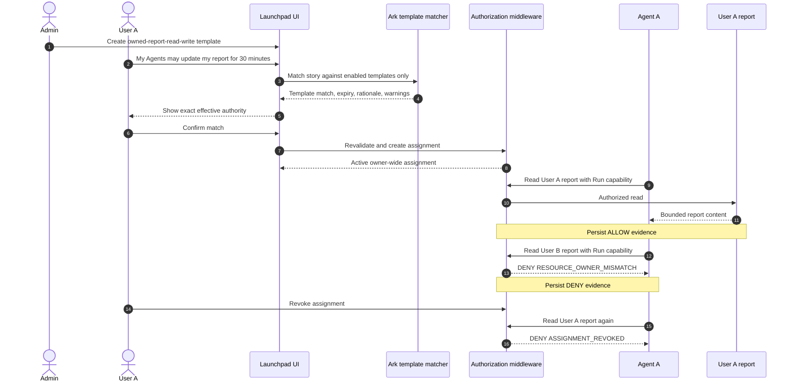

# Agent Passport — Identity and Authorization Middleware PRD

**Version:** 0.3  
**Status:** Engineering-ready proposal  
**Last updated:** 29 August 2026

## 1. Executive summary

Agent Passport extends the existing Agent Launchpad identity foundation with a bounded authorization system.

An Admin defines reusable authorization-rule templates. A user describes the authority needed by the Agents they own in ordinary language. Ark may match that story only against the enabled templates made available to it, then presents the exact effective authority for user confirmation. A confirmed assignment applies to all of that user's current and future Agents. At Run time, a backend authorization middleware evaluates the Agent's action against the assignment, resource ownership, template status, expiry, and a short-lived Run capability.

The design deliberately separates three concerns:

1. `APP_AUTH_TOKEN` remains an optional remote deployment gate.
2. Password login and session cookies establish a human identity.
3. Authorization templates and assignments determine which live Agent actions may proceed.

The system fails closed. A prompt cannot invent permissions, cross another user's ownership boundary, or activate authority without user confirmation.

## 2. Current foundation

The following foundation already exists in the codebase and remains the basis for this proposal:

| Capability | Current behavior |
| --- | --- |
| User identity | Password login with persisted users and server-stored, opaque sessions |
| Bootstrap | Initial `admin` user is seeded only when absent; passwords are salted `scrypt` hashes |
| Roles | `admin` and ordinary `user` roles |
| Remote gate | `APP_AUTH_TOKEN` is still required as a bearer token when configured |
| Ownership | Every Agent has an `ownerId`; ordinary users are restricted to their own Agents, Runs, and messages |
| Administration | Admin can manage users and see Agents grouped by owner in the sidebar |
| Persistence | JSON store migration preserves version-1 data and assigns legacy Agents to the initial Admin |

This PRD does not replace those controls. It builds authorization on top of them.

## 3. Goal

Allow an Admin to define a small, reviewable catalog of authorization templates and allow users to activate an appropriate template for all Agents they own through an explainable, confirmed story-to-template flow.

For the MVP, a live Agent action must be authorized by the backend before it can read or write a protected resource.

## 4. Non-goals

- User-created templates or user-defined arbitrary policy language.
- Public registration, self-service elevation, or additional Admin creation.
- Permissions that span users or permit access to unregistered resources.
- Automatic activation from a story without a confirmation screen.
- Using a model as the final authorization decision-maker.
- General-purpose external connector support in the first release.
- Replacing the existing Agent UUID identity or existing control-plane ownership checks.

## 5. Roles and scope

| Actor | Permitted activity |
| --- | --- |
| Admin | Create, edit, enable, and disable reusable rule templates; view all assignments and evidence; enable or disable an Agent's authorization capability. |
| Ordinary user | Submit a story for the Agents they own, inspect a proposed match, confirm or revoke their own assignment, and access only their own Agents and resources. |
| Agent | Uses its existing UUID as its principal. It may request a protected action only while executing a valid Run. |
| Ark matcher | Produces structured candidate matches from the requesting user's story and the limited, enabled template catalog. It never directly grants authority. |

An assignment is owner-wide: it applies to **all current and future Agents owned by that user**. It never applies to another user's Agents.

## 6. MVP scenario

1. An Admin creates the enabled template `owned-report-read-write`, which permits `read` and `write` on the `report` category for up to 120 minutes.
2. User A writes: “My Agents may update my report for 30 minutes.”
3. Ark selects the compatible template and returns a structured candidate with a 30-minute expiry, rationale, and warnings.
4. User A confirms the exact preview.
5. Agent A, owned by User A, can read or write User A's registered report during an eligible Run.
6. Agent A cannot read User B's report, even if the categories match.
7. User A revokes the assignment. Subsequent Agent A actions are denied.

## 7. Architecture and sequence

## 8. Functional requirements

### FR-01: Preserve identity and owner isolation

Existing password/session authentication, optional `APP_AUTH_TOKEN` gate, Admin-only management, and Agent/Run ownership enforcement remain mandatory. Authorization endpoints require a valid user session and, where configured, the existing bearer token.

### FR-02: Agent authorization status

Each Agent gains `authorizationStatus: active | disabled`, defaulting to `active` during migration and creation. An Admin can disable an Agent's authorization capability. A disabled Agent receives `AGENT_DISABLED` for protected actions while retaining ordinary control-plane visibility according to existing ownership rules.

### FR-03: Admin-managed template catalog

Only an Admin may create, edit, enable, or disable templates. A template contains a stable name, human description, allowed actions, allowed resource categories, maximum duration in minutes, status, and audit timestamps. Template deletion is deferred from the MVP; disabling preserves history and blocks new confirmation and runtime use.

### FR-04: Bounded story-to-template matching

An authenticated user may submit free text as a story draft. The matcher receives only enabled templates and permitted categories, never hidden data or broad policy authoring instructions. It returns strict structured output: candidate template IDs, requested action/category subset, requested expiry, rationale, warnings, and unresolved clauses.

No valid candidate, malformed output, unavailable matcher, or ambiguity leaves existing assignments unchanged. The UI offers manual selection from the enabled templates as a fallback, still followed by the same preview and confirmation.

### FR-05: Exact preview and explicit confirmation

Before an assignment is created, the UI must show the source story, selected template, allowed actions/categories, scope (`all_owner_agents`), expiry, warnings, and unresolved text. Confirmation must revalidate the template and requested limits server-side. The server snapshots the effective authority at confirmation time.

### FR-06: Live protected actions

Agents access protected resources only through backend middleware during a valid Run. The first MVP supports bounded `read` and `write` operations. Browser clients cannot call the Agent authorization action endpoint directly. The transport between runtime and middleware is an internal Unix socket or equivalent private local channel.

### FR-07: Resource ownership boundary

Every protected resource has an `ownerId` and a category. An Agent may access only a resource owned by the Agent's owner. Matching category alone is insufficient; mismatched ownership is denied before template evaluation.

### FR-08: Revocation, expiry, and disablement

The owner can revoke their active assignment. Expired, revoked, or superseded assignments are ineffective immediately. Disabling a template prevents new assignments and denies runtime actions that rely on it. Agent disablement is also immediate.

### FR-09: Durable decision evidence

Every authorization decision persists a minimal allow/deny record with actor and Run context, action, resource label, template/assignment references where applicable, result, reason code, and timestamp. Content, passwords, password hashes, sessions, session tokens, bearer tokens, and Run capabilities must never appear in evidence or logs.

## 9. Deterministic decision model

The backend, not Ark, makes the final decision in this order:

| Order | Check | Denial reason on failure |
| --- | --- | --- |
| 1 | Run capability is valid, unexpired, and bound to this Run and Agent | `RUN_CAPABILITY_INVALID` |
| 2 | Agent authorization status is active | `AGENT_DISABLED` |
| 3 | Resource is registered and owned by the Agent owner | `RESOURCE_INVALID` or `RESOURCE_OWNER_MISMATCH` |
| 4 | An active, unexpired owner-wide assignment exists | `NO_ACTIVE_ASSIGNMENT`, `ASSIGNMENT_EXPIRED`, or `ASSIGNMENT_REVOKED` |
| 5 | The referenced template remains enabled and permits the action and category | `TEMPLATE_DISABLED` or `ACTION_NOT_ALLOWED` |
| 6 | All checks pass | `ALLOW` |

The decision engine is deterministic and testable without a model invocation.

## 10. Data model

Existing records (`User`, `Session`, `Agent`, and `AgentRun`) are extended without weakening existing migrations.

| Record | Required fields |
| --- | --- |
| `Agent` | Existing fields plus `authorizationStatus` |
| `AgentRun` | Existing fields plus `initiatingUserId` |
| `AuthorizationRuleTemplate` | `id`, `name`, `description`, `actions`, `resourceCategories`, `maxDurationMinutes`, `status`, `createdBy`, `createdAt`, `updatedAt` |
| `AuthorizationStoryDraft` | `id`, `ownerId`, `sourceText`, `matchedTemplateIds`, `requestedActions`, `requestedCategories`, `requestedExpiry`, `rationale`, `warnings`, `unresolvedClauses`, `templateCatalogVersion`, `status`, timestamps |
| `UserRuleAssignment` | `id`, `ownerId`, `templateId`, snapshot of allowed actions/categories and maximum duration, `scope: all_owner_agents`, `issuedAt`, `expiresAt`, `status`, revocation data, `draftId`, confirmation metadata |
| `ProtectedResource` | `id`, `ownerId`, `category`, `label`, bounded content/value, timestamps |
| `AuthorizationDecision` | `id`, `timestamp`, `runId`, `initiatingUserId`, `agentId`, `action`, `resourceId`, `resourceLabel`, `assignmentId`, `templateId`, `result`, `reasonCode` |

The JSON-store schema version increments with a deterministic migration: existing Agents gain `authorizationStatus: active`; legacy Runs gain their Agent owner as `initiatingUserId` where derivable; all new collections initialize to empty arrays.

## 11. API contract

All routes below require the existing outer bearer gate when configured and a valid user session. `admin` routes additionally require Admin role.

| Endpoint | Access | Purpose |
| --- | --- | --- |
| `GET /api/authorization/templates` | signed-in user | List enabled templates suitable for preview/manual selection, without Admin-only metadata. |
| `GET /api/admin/authorization/templates` | Admin | List all templates. |
| `POST /api/admin/authorization/templates` | Admin | Create a template. |
| `PATCH /api/admin/authorization/templates/:id` | Admin | Edit a template. |
| `POST /api/admin/authorization/templates/:id/disable` | Admin | Disable a template. |
| `GET /api/resources` | signed-in user | List only the caller's protected resources. |
| `POST /api/authorization/story-drafts` | signed-in user | Create and match a story draft. |
| `GET /api/authorization/story-drafts/:id` | owner or Admin | Retrieve a draft. |
| `POST /api/authorization/story-drafts/:id/confirm` | draft owner | Confirm a revalidated candidate and create an assignment. |
| `GET /api/authorization/assignment` | signed-in user | Retrieve the caller's active/current assignment. |
| `POST /api/authorization/assignment/:id/revoke` | assignment owner or Admin | Revoke an assignment. |
| `POST /api/agents/:id/authorization/disable` | Admin | Disable an Agent's protected-action capability. |
| `POST /api/agents/:id/authorization/enable` | Admin | Re-enable an Agent's capability. |
| `GET /api/runs/:id/authorization-decisions` | Run owner or Admin | Retrieve sanitized evidence for a Run. |

The runtime authorization request is internal-only, not a browser API. It accepts a Run capability, Agent ID, action, and protected resource ID; it returns an allow/deny result plus a safe reason code and bounded resource result when allowed.

## 12. Security and privacy requirements

- Deny by default at every unavailable, invalid, or ambiguous state.
- Validate all route params and request bodies with strict schemas and maximum story/content lengths.
- Hash stored Run capabilities; issue them per Run with short expiry and never persist plaintext capability material.
- Do not restore active in-memory Run capabilities after process restart.
- Bind runtime requests to the Run, Agent, and initiating user; reject replay or cross-Run use.
- Persist only bounded resource values needed for the MVP and redact sensitive values from evidence/logging.
- Keep password/session/bearer-token protections from the existing authentication design unchanged.

## 13. User experience

Admin navigation gains an **Authorization templates** section for catalog management and an assignment/evidence view. Ordinary users gain an **Authorization** workspace that has:

1. Story input.
2. Candidate preview with plain-language authority, expiry, scope, warnings, and unresolved text.
3. Confirm and revoke actions.
4. A visible current-assignment state.

The existing Admin sidebar tree remains an ownership view. It should show a concise disabled authorization indicator on an Agent when applicable, but it must not reveal another user's assignments or protected resources to ordinary users.

## 14. Test case matrix

| ID | Area | Scenario | Expected result | Level |
| --- | --- | --- | --- | --- |
| AUTH-01 | Session | Unauthenticated request to authorization route | `401`; no internal policy detail | API |
| AUTH-02 | Outer gate | Missing or invalid configured bearer token | `401` before session/policy handling | API |
| AUTH-03 | Role | Ordinary user calls Admin template route | `403` | API |
| AUTH-04 | Privacy | Responses and logs contain secrets | No password, hash, session, bearer, or Run capability exposed | Integration |
| OWN-01 | Ownership | User A lists resources | Only User A resources returned | API |
| OWN-02 | Ownership | User A reads User B resource through Agent A | Denied `RESOURCE_OWNER_MISMATCH` | Integration |
| OWN-03 | Ownership | User A fetches User B story draft or assignment | `404` or `403` without disclosure | API |
| OWN-04 | Ownership | Admin reviews users, Agents, and evidence | All allowed by role | UI/API |
| RULE-01 | Template | Admin creates valid template | Persisted with normalized action/category limits | API |
| RULE-02 | Template | Ordinary user attempts create/edit/disable | `403`; no mutation | API |
| RULE-03 | Template | Admin disables template used by active assignment | New confirmations blocked and runtime action denied `TEMPLATE_DISABLED` | Integration |
| STORY-01 | Matching | Story clearly matches an enabled template | Structured candidate contains allowed subset and rationale | Integration |
| STORY-02 | Matching | Story requests action not in any template | No grant; unresolved clause shown | Integration |
| STORY-03 | Matching | Matcher returns malformed output | Draft is safe failure; no assignment mutation | Integration |
| STORY-04 | Matching | Matcher unavailable | Manual enabled-template selection remains possible | UI/API |
| CONFIRM-01 | Confirmation | User confirms matching candidate | Active owner-wide assignment created | Integration |
| CONFIRM-02 | Confirmation | Template changes/disabled after preview | Confirmation revalidation rejects it | API |
| CONFIRM-03 | Confirmation | User does not confirm preview | No assignment is created | API |
| ASSIGN-01 | Scope | User creates Agent after confirmation | New Agent inherits owner-wide authorization evaluation | Integration |
| ASSIGN-02 | Scope | User has multiple Agents | All own Agents can evaluate same assignment | Integration |
| ASSIGN-03 | Scope | User B Agent attempts User A assignment | No applicable assignment found | Integration |
| ACCESS-01 | Allow | Active Agent reads owned resource allowed by template | Bounded result and `ALLOW` evidence | Integration |
| ACCESS-02 | Allow | Active Agent writes owned resource allowed by template | Mutation succeeds and evidence persists | Integration |
| ACCESS-03 | Policy | Action outside template allowance | Denied `ACTION_NOT_ALLOWED` | Integration |
| ACCESS-04 | Policy | Resource category outside allowance | Denied `ACTION_NOT_ALLOWED` | Integration |
| ACCESS-05 | Agent | Admin-disabled Agent requests protected action | Denied `AGENT_DISABLED` | Integration |
| CAP-01 | Run capability | Missing capability | Denied `RUN_CAPABILITY_INVALID` | Integration |
| CAP-02 | Run capability | Capability used from another Agent or Run | Denied `RUN_CAPABILITY_INVALID` | Integration |
| CAP-03 | Run capability | Expired/replayed capability | Denied `RUN_CAPABILITY_INVALID` | Integration |
| REVOKE-01 | Lifecycle | User revokes own assignment | Later action denied `ASSIGNMENT_REVOKED` | Integration |
| REVOKE-02 | Lifecycle | Assignment naturally expires | Later action denied `ASSIGNMENT_EXPIRED` | Integration |
| REVOKE-03 | Lifecycle | User tries to revoke another user's assignment | `404` or `403`; no mutation | API |
| REVOKE-04 | Lifecycle | Process restarts during/after Run | Active runtime capability does not survive restart | Integration |
| EVID-01 | Evidence | Allow decision stored | Includes safe actor/Run/action/resource/template references | Store/API |
| EVID-02 | Evidence | Deny decision stored | Includes exact safe reason code | Store/API |
| EVID-03 | Evidence | Evidence response inspected | Does not contain sensitive resource content or secrets | API |
| REG-01 | Regression | Existing Agent/Run ownership tests | Continue to pass | Test suite |
| REG-02 | Migration | Existing JSON data migrates | Agents active, data retained, new collections initialized | Store test |
| DEMO-01 | End-to-end | Admin template, User A story/confirm, allowed own read, denied cross-owner read, revoke | Complete auditable flow works | Browser/API |

## 15. Demonstration flow

1. Sign in as Admin and create the `owned-report-read-write` template.
2. Create or select User A and User B, each with a registered report and Agent.
3. Sign in as User A and submit the 30-minute report-update story.
4. Show the matched template preview and confirm it.
5. Run Agent A against User A's report and show the allowed result and evidence.
6. Attempt Agent A access to User B's report and show `RESOURCE_OWNER_MISMATCH` evidence.
7. Revoke User A's assignment and retry the owned action.
8. Show the denied result and final evidence, then sign in as Admin to review the audit trail.

## 16. Delivery phases

| Phase | Scope | Completion signal |
| --- | --- | --- |
| 1 | Schema migration, template/assignment/resource/evidence repositories, deterministic evaluator | Unit tests cover every decision reason |
| 2 | Admin template catalog, resource fixture/management, assignment lifecycle APIs | Role and owner boundaries pass API tests |
| 3 | Story drafts, bounded matcher contract, preview, confirmation, manual fallback | No story path creates authority without confirmation |
| 4 | Run capability issuance, private runtime transport, read/write enforcement | End-to-end allow and deny actions work |
| 5 | Evidence UI, Admin inspection, regression/security validation, demo polish | Test matrix and production build pass |

## 17. Metrics

- Percentage of story drafts resolved to a confirmed template without manual fallback.
- Percentage of confirmations that are later revoked before expiry.
- Allow/deny decision counts by reason code and template.
- Zero cross-owner allows in automated tests and demonstration data.
- Median evaluation latency and matcher latency measured separately.

## 18. Risks and mitigations

| Risk | Mitigation |
| --- | --- |
| Model over-interprets a story | Template-bounded schema, exact preview, server revalidation, explicit confirmation |
| Stale authority | Short expiry, immediate revocation, template disablement, Run-bound capability |
| Cross-user data leak | Ownership check precedes policy evaluation; avoid existence-revealing responses |
| Unsafe runtime entry point | Private transport, hashed expiring capability, Run/Agent binding, strict validation |
| Audit data leaks secrets | Minimal fields, bounded result data, redaction tests |
| Policy drift from edits | Snapshot effective limits at confirmation and retain template/version references |

## 19. Resolved decisions

| Decision | Resolution |
| --- | --- |
| Agent principal | Reuse the existing Agent UUID. |
| Template ownership | Global catalog managed only by Admin. |
| Assignment scope | All current and future Agents for the assignment owner. |
| Expiry | Derived from the confirmed candidate, capped by template maximum. |
| Ark authority | Bounded matcher and explanation provider only; backend policy evaluator decides. |
| Runtime transport | Internal Unix socket or equivalent private local channel with a Run-bound capability. |
| Existing behavior | Existing authentication, remote gate, ownership controls, and Agent sidebar tree are retained. |

## 20. Definition of done

- Admin can manage templates without ordinary-user access.
- Ordinary users can create a story draft, inspect a bounded preview, and confirm or revoke only their own assignment.
- No authority is granted before confirmation or beyond the selected template.
- Assignments work for all current and future Agents of one owner only.
- Live `read` and `write` actions are enforced by backend middleware with a valid Run capability.
- Cross-owner, expired, revoked, disabled-Agent, disabled-template, invalid-capability, and unsupported-action attempts fail closed with tested reason codes.
- Decision evidence is durable, safe, and visible only to the owner or Admin as appropriate.
- Existing authentication, migration, ownership, server tests, typechecks, and production build remain green.

## 21. Judge positioning

The differentiator is not a model that writes policy. It is an explainable human-in-the-loop authorization system: Admins constrain the possible authority, users confirm a precise interpretation of their story, and the backend enforces that result during real Agent actions with ownership boundaries and auditable evidence.
