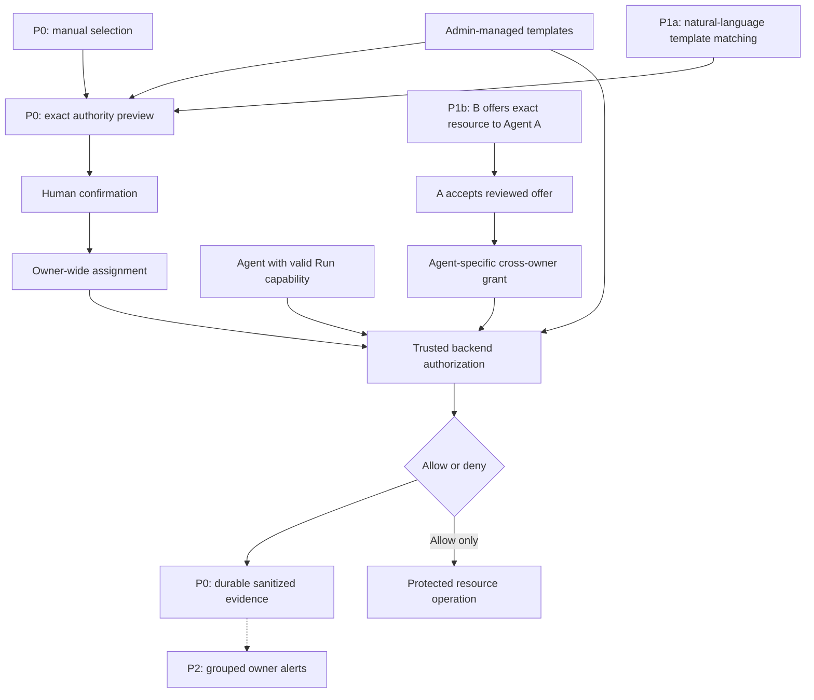

# Agent Passport - Identity and Authorization Middleware PRD

**Version:** 0.5  
**Status:** Implemented policy-model revision; template sections below are retained as superseded history  
**Last updated:** 31 August 2026  
**Base:** Team-supplied v0.3 dated 29 August 2026  
**Capacity assumption:** One engineer; two product/analytics teammates; one communicator  
**Delivery principle:** Finish and verify the authorization core before adding collaboration or notification features.

## 1. Executive summary

### Current policy-model revision

The Admin-managed authorization-template catalog and setup-time story adjudication are removed. Each signed-in Agent owner now writes one free-text sharing policy for their resources; the text is stored as written without an LLM call. Same-owner reads remain deterministic. Ark is called only when another owner’s Agent requests a shareable resource, using the owner policy, requesting Run prompt, Agent name, category, and safe offer description.

An Admin may still operate user accounts, disable an Agent's protected-action capability, and inspect sanitized evidence, but cannot author, approve, edit, disable, or revoke another owner's policy. P1b no longer uses offers, recipient acceptance, or grants: the resource owner enables request-time sharing, and Ark makes the request-specific read-only decision. Stories cannot create cross-owner authority by themselves.

All references below to templates, template matching, manual template selection, setup-time policy adjudication, or Admin policy management describe the superseded v0.4 design and must not be used as implementation requirements.

Agent Passport controls what an Agent may do on behalf of a human. Admins define bounded authorization templates, humans confirm exact permissions, and backend middleware enforces those permissions on real protected actions. Separate human and Agent identities, scoped authority, expiry, revocation, and attributable evidence form the core.

The core remains the v0.3 owner-isolated model: an assignment applies to all current and future Agents of one owner, but does not authorize access to another owner's resources. A selected Agent still needs a valid Run capability and active authorization status.

Two differentiation layers are staged after the core:

1. Natural-language matching: Ark maps a user's story only to enabled Admin templates; a human confirms the exact result.
2. Cross-owner access offers: Resource Owner B proactively offers one named Agent A read-only access to one registered resource for a limited period. Agent Owner A must accept before the Agent can read. Either owner can revoke. No protected content is disclosed with the offer.

Grouped notifications about blocked access are later polish, not a prerequisite for security. Every authorization decision is recorded even when no notification is sent.

The existing outer deployment gate, password/session authentication, and Agent/Run ownership controls are retained. No prompt or model output is an authorization credential.

### Priority contract

| Priority | Meaning | Scope | Stop rule |
| --- | --- | --- | --- |
| P0 | Required for a complete core release | Existing identity protections; Admin templates; manual selection and exact confirmation; owner-wide assignments; real protected read/write enforcement; Run binding; expiry/revocation/disablement; evidence; tests and demo | Do not start optional engineering until the P0 gate passes. |
| P1a | First differentiator | Natural-language story-to-template matching using the same P0 preview and confirmation path | Ship P0 if this is unreliable; keep manual selection available. |
| P1b | Second differentiator | Owner-initiated, two-sided, Agent-specific cross-owner read offer | Ship P0 + P1a if any sharing security condition is incomplete. |
| P2 | Nice-to-have | Grouped blocked-access alerts, notification inbox, visual polish and richer filtering | Drop first when time is constrained. |
| P3 | Explicitly deferred | General Agent chat, cross-owner writes, re-delegation, enterprise integrations, real personal-data sharing | Do not build for this submission. |

P1a and P1b both depend on P0; P1b does not technically require an LLM. The recommended product sequence is P0, then P1a, then P1b, then P2. If a feature already works, preserve it; prioritization is not an instruction to delete completed work. No calendar estimates are claimed without the engineer's repository review.

## 2. Current foundation

The supplied v0.3 PRD reports the following as existing. The engineer should verify them rather than rebuild them.

| Capability | Reported behavior to preserve |
| --- | --- |
| Human identity | Password login; persisted users; server-stored opaque sessions |
| Bootstrap | Initial Admin seeded only when absent; salted scrypt password hashes |
| Roles | Admin and ordinary user roles |
| Remote gate | APP_AUTH_TOKEN remains required when configured |
| Ownership | Agent ownerId; ordinary users restricted to their own Agents, Runs and messages |
| Administration | Admin manages users and sees Agents grouped by owner |
| Persistence | Existing migrations retain legacy data and ownership |

The P0 feasibility check must identify how an actual runner calls the protected tool without bypassing middleware. Resources used in the demo must not also be freely readable through an unprotected file mount or alternate API.

## 3. Goal and problem alignment

**Problem:** Humans need Agents to perform useful work without giving them unrestricted human authority or uncontrolled access to other people's resources.

**P0 answer:** A human confirms bounded authority; an identified Agent performs a real action; the backend permits or blocks it; revocation changes the next decision; evidence explains why.

**P1 answer:** Humans can express authority more easily and safely authorize an explicit cross-owner exception, without weakening default isolation.

| Identity/authorization direction in the supplied problem-statement excerpt | Planned proof | Priority |
| --- | --- | --- |
| Human authentication | Existing authenticated session establishes initiator and confirmer | P0 |
| Per-Agent identity | Existing Agent UUID, Run binding and independent authorization disablement | P0 |
| Delegated authority | Confirmed scoped, time-bound, revocable owner assignment | P0 |
| Trusted policy enforcement | Real tool/resource boundary performs deterministic checks | P0 |
| Action attribution | Durable initiating human, Agent, Run, resource, authority and decision references | P0 |
| Secret handling and revocation | No credentials in evidence; later action denied after revocation | P0 |
| Approval boundaries | Exact assignment confirmation; later, explicit two-owner sharing acceptance | P0 / P1b |

These are proposed demonstrations of the supplied example, not a claim that every suggested feature is mandatory or that official submission compliance has been independently verified. Check the full competition delivery requirements before submission.

## 4. Non-goals and scope boundaries

- P0 does not support cross-owner access; P1b adds one explicit, narrowly scoped exception.
- No user-authored templates, arbitrary policy language, or authority invented by a model.
- No automatic activation from a story, notification, Agent message, or sharing offer.
- No general Agent-to-Agent chat or Agent discovery of other users' private resources.
- No cross-owner write/delete, wildcard resource grants, onward sharing, or grants to all recipient Agents.
- No real customer addresses or production personal data. Use synthetic city-level example data if showing the FYP/Profile story.
- No implicit human right to preview protected content. A human accepts using safe offer metadata only.
- No external email/push integration or enterprise identity replacement.

## 5. Roles and scope

| Actor | P0 role | P1b extension |
| --- | --- | --- |
| Admin | Manage templates; inspect sanitized evidence; disable Agent authorization | Enable/disable sharing feature and sharing eligibility under platform rules |
| User / Agent Owner A | Confirm or revoke assignments for their own Agents | Accept or reject an offer addressed to one Agent they own; revoke accepted access |
| Resource Owner B | Manage their own registered resources and assignments | Offer a specific resource to a specific Agent; cancel pending offer or revoke active access |
| Agent A | Use its UUID and valid Run capability for authorized protected actions | Receive only safe offer metadata; surface an approval task to its owner; read only after acceptance |
| Ark matcher | No role in P0 authorization decisions | P1a maps stories to existing templates; never accepts offers or creates authority itself |

**Two distinct permission scopes must remain explicit:**

- Owner assignment: v0.3 behavior retained, applies to all current and future Agents of the owner. The preview must say this clearly. It is less granular than per-Agent task grants and is a conscious MVP trade-off.
- Cross-owner grant: applies only to the named Agent and exact resource. It never inherits to other or future Agents, even with the same owner-wide assignment.

For the FYP/Profile analogy, FYP and Profile are product areas. Their responsible humans are User A and User B; the app itself is not a human principal.

## 6. MVP scenarios and release gates

### P0: Complete owner-isolated core

1. Admin enables a bounded report read/write template with maximum duration 120 minutes.
2. User A manually selects a permitted action/category subset and 30-minute expiry.
3. Preview shows exact effective authority and all-owner-Agents scope; User A confirms.
4. Agent A performs a real allowed read or write on User A's registered report.
5. Agent A attempts User B's report; backend denies with no protected content or mutation.
6. User A revokes the assignment; the next formerly allowed action is denied.
7. Evidence identifies the human, Agent, Run, authority, requested operation and outcome.

**Gate G0:** P0 acceptance tests, existing regression checks and production build pass; demo works from documented setup. This is a valid stopping point for the engineering scope.

### P1a: Natural-language convenience

User A writes: "My Agents may update my report for 30 minutes." Ark returns a template-bounded proposal. It cannot activate anything. User A reviews and confirms through the same P0 path. Unsupported or ambiguous clauses are unresolved, not silently dropped.

**Gate G1a:** Happy path, ambiguous input, malformed model output, unavailable model and no-confirmation cases pass. Manual fallback still works.

### P1b: Proactive cross-owner offer

1. Resource Owner B selects their synthetic city-summary resource and one eligible Agent A.
2. B offers read-only access until an explicit expiry. This authenticated offer records B's consent but grants no access yet.
3. Agent A receives only a safe description such as "City-level summary offered for local-content recommendations" and an offer reference. No resource payload is included.
4. Agent A surfaces an owner approval task. User A accepts or rejects through authenticated UI; the Agent cannot accept for them.
5. On acceptance, backend revalidates both owners, exact Agent/resource, the recipient owner's sharing opt-in, version and expiry; only then creates the grant. P1b does not use P0 templates or assignments.
6. Agent A can read that one resource, while another Agent of User A cannot use this grant.
7. Either owner revokes or the grant expires; subsequent reads are denied.

**Gate G1b:** Pending/rejected/stale/expired/unauthorized offers never expose content; valid accepted read works; wrong Agent, write and post-revocation cases fail. Feature-off preserves P0 behavior.

### P2: Grouped security awareness

After a blocked cross-owner attempt, User B may see: "Agent A made 5 blocked read attempts in the last 10 minutes. No content was shared." This is an alert, not an approval or permission request.

**Gate G2:** Duplicates aggregate without losing P0 decision records; owner isolation and bounded metadata hold. Alert failure cannot change allow/deny behavior.

## 7. Architecture and sequence

### Core plus optional layers



### P1b: No content before both approvals

```mermaid
sequenceDiagram
    autonumber
    actor B as Resource Owner B
    participant UI as Offer and approval UI
    participant Auth as Trusted backend
    participant Agent as Agent A
    actor A as Agent Owner A
    participant R as Resource B
    B->>UI: Offer one resource, read-only, expiry, named Agent
    UI->>Auth: Validate B ownership and create pending offer
    Auth-->>Agent: Safe offer metadata only
    Agent-->>A: Surface approval task; no protected content
    Agent->>Auth: Try read before acceptance
    Auth-->>Agent: DENY; no active cross-owner grant
    A->>UI: Accept exact offer version
    UI->>Auth: Revalidate both owners, policy, assignment and expiry
    Auth-->>UI: Activate Agent-specific grant
    Agent->>Auth: Read exact resource with valid Run capability
    Auth->>R: Authorized bounded read
    R-->>Auth: Bounded resource result
    Auth-->>Agent: Authorized result
    B->>Auth: Revoke grant
    Agent->>Auth: Repeat read
    Auth-->>Agent: DENY; grant revoked
    Note over Auth,R: Persist sanitized lifecycle and action evidence
```

## 8. Functional requirements and acceptance criteria

| ID | Priority | Requirement | Acceptance criteria |
| --- | --- | --- | --- |
| FR-01 | P0 | Preserve identity and owner isolation | Existing sessions, optional outer gate and Admin roles apply to authorization APIs. Caller cannot supply another owner's identity. Existing control-plane ownership tests remain green. |
| FR-02 | P0 | Independent Agent authorization status | Agent UUID remains principal; active/disabled status checked on every protected action. Disabling one Agent does not disable another. Ordinary users cannot use Admin controls. |
| FR-03 | P0 | Minimal Admin template catalog | Admin can create, inspect, edit and disable bounded action/category/duration templates. Ordinary users cannot mutate catalog. No template deletion needed. |
| FR-04 | P0 | Manual selection and exact confirmation | User selects an allowed subset and expiry. Preview shows all-current-and-future-owner-Agents scope. No assignment before confirmation. Stale catalog/draft version or unresolved fields rejected. Server snapshots exact accepted scope. |
| FR-05 | P0 | Real runtime enforcement | Protected read/write requires private runtime channel and valid Run/Agent-bound capability. Browser cannot invoke runtime route directly. No unprotected file/API path to the demo resource. Denied read discloses no content; denied write makes no mutation. |
| FR-06 | P0 | Assignment lifecycle | One current assignment per owner; replacement supersedes old assignment atomically. Every action checks expiry, revocation, Agent status and template status. New Agents inherit only the owner assignment, never a cross-owner grant. |
| FR-07 | P0 | Durable evidence and minimal viewer | Record allow/deny and assignment lifecycle with safe attribution. Owner/Admin views respect access rules. Persist across restart. Never log tokens, password hashes, sessions or protected content. |
| FR-08 | P1a | Bounded story-to-template matching | Ark receives enabled permitted catalog only; returns strict candidate schema, requested subset/expiry, rationale, warnings and unresolved clauses. Malformed/unavailable/ambiguous output creates no authority. Manual fallback uses FR-04. |
| FR-09 | P1b | Owner-initiated offer | B can offer only an owned, share-eligible registered resource, read-only, to exactly one opted-in/eligible Agent, with a future capped expiry. Offer is authenticated B consent. Duplicate submission is idempotent. Pending offer grants nothing. |
| FR-10 | P1b | Metadata-only handoff and owner acceptance | Agent sees only curated offer metadata, not data content or content-derived summary. A may accept/reject only offers for an Agent they own. Agent or forged caller cannot accept. A sees exact resource descriptor, Agent, read scope and expiry. Human preview of protected content is excluded. |
| FR-11 | P1b | Safe cross-owner grant activation | Acceptance atomically revalidates offer version, pending state, B resource ownership, A Agent ownership, the recipient owner's explicit sharing opt-in and platform limits. P1b does not require an Admin template or recipient assignment. Stale/cancelled/expired/mismatched offer rejected. Retry cannot create multiple active grants. Changes require a new offer and approval. |
| FR-12 | P1b | Agent-specific enforcement and revocation | Require an exact Agent/resource/read grant. Other Agents and writes are denied. Either owner or Admin may revoke; B may cancel before acceptance. Expiry, revocation, resource-sharing disablement, or feature disablement affects the next action. No onward delegation. |
| FR-13 | P1b | Two-owner lifecycle evidence | Record offer, acceptance/rejection, cancellation, activation, expiry and revocation with both owners and exact Agent/resource/grant references. Each owner sees only their relevant sanitized records, not the other owner's full Run/messages. |
| FR-14 | P2 | Bounded owner security alerts | Group repeated trusted blocked attempts by resource owner, resource, Agent and reason. In-app only. No raw content or secrets. Every attempt remains in P0 evidence. Read/dismiss is not acceptance and never creates a grant. |
| FR-15 | P2 | UI polish and filtering | Add alert counts, filters and clearer status badges only after correctness gates pass. No UI-only security logic. |

All safety criteria within an enabled feature are mandatory. P1b does not mean its validation or revocation may be omitted; it means the entire feature may be omitted.

## 9. Deterministic decision model

### P0 path

1. Validate Run capability, channel, Run state, Agent binding and initiating human context. Failure: `RUN_CAPABILITY_INVALID`.
2. Check active Agent authorization and valid ownership context. Failure: `AGENT_DISABLED` or `AGENT_CONTEXT_INVALID`.
3. Resolve registered resource. Failure: `RESOURCE_INVALID` with a safe external response.
4. Check owner equality. P0 mismatch: `RESOURCE_OWNER_MISMATCH`; no protected result.
5. Load current active owner assignment; reject absent, expired, revoked or superseded assignment.
6. Check both the confirmed assignment snapshot AND current enabled template permit requested action/category. Current template edits may narrow authority, never silently widen an existing snapshot.
7. Perform the protected operation and record the authorization decision plus execution outcome. A permitted action may still fail for a non-authorization reason; do not label that operation successful.

### P1b cross-owner branch

When the feature is enabled, an owner mismatch routes to an explicit grant check, not an automatic allow or a global removal of isolation. Valid Run context and exact ownership checks still apply; P0 assignment/template checks do not apply to this P1b exception.

Require a live grant matching the exact recipient Agent, current Agent owner, current resource owner, resource ID and `read` action. Require the grant's original offer/acceptance, current sharing eligibility, non-expiry and non-revocation. Otherwise deny with a safe reason such as `CROSS_OWNER_GRANT_REQUIRED`, `CROSS_OWNER_GRANT_EXPIRED`, `CROSS_OWNER_GRANT_REVOKED` or `SHARING_DISABLED`.

Effective P1b authority is the intersection of platform limits, valid Run context and the exact cross-owner grant. B's offer alone cannot authorize access; A's authenticated acceptance alone cannot access a resource without B's offer.

Evaluate at the protected operation boundary. Revocation blocks later operations, but cannot erase data already returned or undo an operation already completed. Serialize grant checks with protected mutations where relevant; do not promise retroactive withdrawal of knowledge.

## 10. Data model

Preserve v0.3 models and migration behavior. New optional collections initialize empty and do not activate sharing on migration.

| Record | Priority | Essential fields / constraints |
| --- | --- | --- |
| Agent | P0 | Existing UUID and ownerId; authorizationStatus |
| AgentRun | P0 | initiatingUserId; trusted runner binding; short-lived capability association |
| AuthorizationRuleTemplate | P0 | id, name, description, allowed actions/categories, maximum duration, status, version, creator and timestamps |
| AuthorizationStoryDraft | P0 / P1a | owner, selected template/subset/expiry, catalog version, status; sourceText/rationale/warnings/unresolvedClauses populated for P1a |
| UserRuleAssignment | P0 | ownerId, templateId/version, confirmed action/category snapshot, scope all_owner_agents, issuedAt/expiresAt/status, draftId and confirmation/revocation metadata |
| ProtectedResource | P0 | id, ownerId, category, safe label, bounded synthetic value; P1b adds sharing eligibility and safe offer descriptor |
| AuthorizationDecision | P0 | timestamp, Run, initiator, Agent, action, resource reference, assignment/template, decision, reason and execution result; P1b adds optional crossOwnerGrantId |
| AccessOffer | P1b | id, resourceOwnerId, resourceId, recipientOwnerId, recipientAgentId, action read, curated descriptor, expiry, version, status, offeredAt, accepted/rejected/cancelled metadata |
| CrossOwnerGrant | P1b | id, offerId/version, both owner IDs, exact recipientAgentId/resourceId, action read, issuedAt/expiresAt, status, revocation actor/time |
| AuthorizationLifecycleEvent | P0 / P1b | actor, event type, related assignment/offer/grant IDs, timestamp, bounded safe state change; no payload content |
| SecurityAlert | P2 | ownerId, grouping key, count, first/last occurrence, safe descriptor, read/dismiss status |

Offer states: `pending -> accepted`, `rejected`, `cancelled` or `expired`. Accepted offers link to a grant whose effective states are `active`, `revoked` or `expired`. Pending offer cancellation and active grant revocation are different actions. State transitions and grant creation are atomic and idempotent.

## 11. API contract

All public routes retain the configured outer bearer gate and session validation. Object ownership is checked server-side; ordinary users cannot provide trusted actor fields. Mutating cookie-session routes retain the application's CSRF protections.

| Route / capability | Priority | Access and purpose |
| --- | --- | --- |
| GET /api/authorization/templates | P0 | Signed-in user; enabled permitted templates |
| GET/POST /api/admin/authorization/templates | P0 | Admin catalog list/create |
| PATCH /api/admin/authorization/templates/:id | P0 | Admin edit with version handling |
| POST /api/admin/authorization/templates/:id/disable | P0 | Admin disables future and runtime use |
| GET /api/resources | P0 | Caller-owned resources only, even when sharing is enabled |
| POST /api/authorization/story-drafts | P0 / P1a | Manual structured selection in P0; bounded matching mode in P1a |
| GET /api/authorization/story-drafts/:id | P0 | Draft owner or Admin |
| POST /api/authorization/story-drafts/:id/confirm | P0 | Draft owner; exact reviewed version, no unresolved clauses |
| GET /api/authorization/assignment | P0 | Current caller assignment |
| POST /api/authorization/assignment/:id/revoke | P0 | Assignment owner or Admin |
| POST /api/agents/:id/authorization/disable or /enable | P0 | Admin controls independent Agent capability |
| GET /api/runs/:id/authorization-decisions | P0 | Run owner or Admin; not broadened for cross-owner sharing |
| POST /api/access-offers | P1b | Resource owner; validate exact resource and eligible recipient |
| GET /api/access-offers | P1b | Only caller's sent/received offers, safe metadata |
| POST /api/access-offers/:id/accept or /reject | P1b | Current recipient Agent owner only; reviewed version required |
| POST /api/access-offers/:id/cancel | P1b | Offering owner or Admin; pending offers only |
| POST /api/cross-owner-grants/:id/revoke | P1b | Either recorded owner or Admin |
| GET /api/cross-owner-grants/:id/events | P1b | Related owners or Admin; sanitized offer/grant events only |
| GET /api/security-alerts | P2 | Resource owner's grouped alerts |

Runtime protected operations remain private, not browser APIs. Input: capability, Agent ID, action and resource ID. Backend derives trusted ownership and checks binding; output contains a safe denial or bounded authorized result. A browser approval route never returns resource content merely because an offer was accepted.

P1b recipient selection uses a small Admin-approved demo directory or explicit opt-in recipient handles, not unrestricted enumeration of users' Agents. Capability-based access must not make arbitrary resource IDs or offer IDs into authority.

## 12. Security and privacy requirements

### P0 - non-negotiable

- Fail closed on invalid, unavailable or ambiguous authorization state.
- Strict schemas and bounded request/content lengths; backend resolves all trusted actor/resource fields.
- Short-lived Run capabilities are bound to Run/Agent/context; store hashes rather than plaintext. Restart invalidates active capability material; completed/cancelled Runs cannot keep using it.
- Define replay handling explicitly: if a capability supports multiple operations within a Run, protect operation replay separately with request IDs/nonces where required; possession of a reusable Run token is not a claim of one-time semantics.
- Check assignment snapshot and current template together. Template expansion never expands an existing confirmed assignment without renewed confirmation.
- Keep provider secrets in the trusted backend; exclude tokens, sessions, hashes and resource content from logs/evidence.
- Protected resources must not be directly accessible through the runtime filesystem or an alternate unguarded route.

### P1b - required whenever sharing is enabled

- Feature off by default until G1b passes; turning it off denies cross-owner operations without affecting own-resource P0 use.
- Require both authenticated owners; Agent messages cannot constitute owner consent.
- Pending offers carry safe descriptors, never raw values, attachments, secret URLs or model-generated summaries of protected content.
- Scope is one Agent, one resource, read-only, no wildcard, no transfer and no onward delegation.
- Grant expiry cannot exceed the offer expiry or platform duration cap. P1b reads require the current exact grant, not an Admin assignment.
- Owner/Agent/resource changes invalidate eligibility; never silently retarget an accepted grant.
- Serialize acceptance/cancellation/revocation transitions and reject stale versions; duplicate clicks do not create duplicate grants.
- Receiving an offer grants neither A nor Agent A a human-content-preview right. Authorized human preview is deferred.
- Ownership mismatch diagnostics must not expose resource content or private directory information to an untrusted caller.

## 13. User experience

| Priority | Minimum UI |
| --- | --- |
| P0 | Admin template controls; user template/subset/expiry selector; exact preview and confirm; current assignment/revoke; compact Run evidence |
| P1a | Story input above existing selector; matched candidate, warnings and unresolved text; manual fallback |
| P1b | B's offer form; A's pending-offer approval task; accept/reject; both owners' grant status/revoke. Safe metadata-only Agent handoff may be a deterministic system card, not an LLM conversation. |
| P2 | Resource-owner security inbox, grouped alerts, filters, badges and visual refinements |

Suggested P2 policy: notify on the first verified blocked cross-owner attempt, then aggregate repeats with the same owner/resource/Agent/reason into one alert for 10 minutes. Show count and last-attempt time. This interval is a proposed demo default, not a security standard. Bound distinct alerts per owner/window; overflow goes to a summary. Invalid identity attempts go to Admin evidence, not personalized accusations. Notifications never auto-create offers or approvals.

## 14. Prioritized test matrix

Each row is an acceptance-test group, not evidence that a test has already passed. Retain applicable v0.3 tests; the groups below define release gates.

| ID | Priority | Scenario | Expected result |
| --- | --- | --- | --- |
| CORE-01 | P0 | Missing session/outer gate; ordinary user calls Admin route | 401/403, no mutation or secret disclosure |
| CORE-02 | P0 | Caller lists another owner's resources, Runs or drafts | Denied / not disclosed |
| CORE-03 | P0 | Manual draft without confirmation; stale version or out-of-template subset | No assignment |
| CORE-04 | P0 | Confirm valid subset and expiry | Only reviewed authority activated; correct owner-wide scope |
| CORE-05 | P0 | Read/write own allowed resource during valid Run | Actual bounded result/mutation and evidence |
| CORE-06 | P0 | Cross-owner read/write with sharing off | Denied; no content or mutation |
| CORE-07 | P0 | Wrong action/category; broader current template than snapshot | Denied outside confirmed subset |
| CORE-08 | P0 | Revoked, expired or superseded assignment; disabled template/Agent | Next protected action denied |
| CORE-09 | P0 | Missing/expired/wrong-Run capability; completed Run; restart | Denied; no active capability restored |
| CORE-10 | P0 | Direct filesystem/API bypass; forged Agent/owner | No unauthorized protected access |
| CORE-11 | P0 | Persistence, migration, attribution, secret scan | Existing data retained; safe durable evidence; no credentials |
| CORE-12 | P0 | New owned Agent and second owned Agent | Owner assignment applies; independent disablement works |
| CORE-13 | P0 | Existing regressions, typechecks, build and live core demo | Pass before optional work |
| NL-01 | P1a | Clear story matches enabled template | Exact bounded proposal; still requires confirmation |
| NL-02 | P1a | Unknown action, ambiguity, contradictory or injected instruction | Unresolved/rejected; no extra authority |
| NL-03 | P1a | Malformed/unavailable matcher; no user confirmation | Existing state unchanged; manual fallback works |
| SHARE-01 | P1b | Valid B offer, before A acceptance | Agent gets metadata only; read denied |
| SHARE-02 | P1b | B offers unowned resource; Agent/other human tries acceptance | Rejected, no grant |
| SHARE-03 | P1b | Valid A acceptance and read | Exact Agent/resource read succeeds within all ceilings |
| SHARE-04 | P1b | A rejects; B cancels; offer expires | No grant or content access |
| SHARE-05 | P1b | Other Agent of A; different resource; write/delete | Denied despite accepted offer |
| SHARE-06 | P1b | Either owner revokes; grant expires; sharing disabled | Next read denied |
| SHARE-07 | P1b | Recipient Agent has not opted in; sharing eligibility is withdrawn | Offer creation/acceptance denied; existing grant remains exact and revocable |
| SHARE-08 | P1b | Stale offer version, changed ownership, duplicate acceptance, accept/cancel race | No stale or duplicate active grant |
| SHARE-09 | P1b | B views shared evidence; A inspects offer payload | Relevant sanitized records only; no other user's full Run/data |
| SHARE-10 | P1b | Feature off and regression rerun | Original owner-isolated P0 path unchanged |
| ALERT-01 | P2 | Repeated blocked attempts and many distinct attempts | Grouped/capped alerts; complete underlying decisions |
| ALERT-02 | P2 | Read/dismiss alert; alert delivery failure | No permission change; backend security unaffected |

## 15. Demonstration flow

### P0 demo - always keep ready

Admin template -> manual preview and confirmation -> real own-resource action succeeds -> cross-owner attempt fails -> assignment revoked -> original action now fails -> evidence inspected.

### P1a upgrade

Replace manual entry with a live story match, but keep the same preview and confirmation. Show that the draft alone grants nothing. If the model is unavailable, transparently use the manual fallback rather than pretending a live match succeeded.

### P1b upgrade - strongest collaboration proof

Agent A cannot read B's synthetic resource -> B offers access -> still cannot read while pending -> A accepts -> exact read succeeds -> a second Agent remains denied -> either owner revokes -> original read fails again.

Show the two owners, exact Agent/resource, read scope and expiry together. This is controlled delegation, not general Agent messaging. The pending approval card is sufficient; no chat orchestration is needed.

P2 alerts are a short optional end card. Rehearse to the actual competition demo limit; no official duration is assumed here.

## 16. Delivery phases and work allocation

| Order | Engineer work | Product/analytics work | Communicator work | Completion signal |
| --- | --- | --- | --- | --- |
| 1 - P0 spike | Verify existing auth; find trusted runtime boundary; prove one real allowed and denied operation | Prepare synthetic resource pair and expected access table | Draft 30-second problem explanation | Real enforcement proven outside UI |
| 2 - P0 core | Models/migrations, evaluator, manual confirmation, expiry/revocation, private Run channel, minimal APIs/UI | Define exact previews; run acceptance walkthroughs; maintain scenario checklist | Draft core demo script and setup README outline | G0 tests and demo pass |
| 3 - P1a | Plug bounded matcher into existing draft contract; preserve fallback | Prepare clear/ambiguous/adversarial input set with expected policy outputs | Explain why AI drafts but backend decides | G1a passes |
| 4 - P1b | Offer/grant state machine, exact-Agent scope, two-owner approval, enforcement branch, tests | Prepare offer metadata; consent screens; no-content-before-acceptance and wrong-Agent scenarios | Rehearse pending/accepted/revoked narrative | G1b passes; G0 remains green |
| 5 - P2 | Group alerts and minimal inbox only if time remains | Test grouping/readability and noise | Optional security-awareness end card | G2 passes without core regression |
| 6 - freeze | Fix defects, verify clean setup/build, disable incomplete optional paths | Verify all claimed scenarios against actual build | Final rehearsal and backup recording if competition permits | Submission claims match working behavior |

**Cut line:** Drop P2 first, then P1b if its complete safety gate is not achievable, then P1a if unstable. Never cut backend enforcement, revocation, safe evidence or tests to keep an optional feature. Reserve the final development window for integration and rehearsal rather than new scope; the team must set that window against the actual deadline.

## 17. Metrics and evidence

| Priority | Measure | Target / interpretation |
| --- | --- | --- |
| P0 | Unauthorized protected access in defined tests | Zero; include cross-owner, wrong scope and revoked authority |
| P0 | Defined allow/deny and regression scenarios | All passing before G0 |
| P0 | Attribution completeness and seeded secret leakage | Required fields present; zero leaked secrets |
| P0 | Runtime evaluation latency | Measure median and tail separately from model matching; report observations, not invented targets |
| P1a | Expected-policy match rate on fixed test set | Report sample size, exact match and manual fallback separately |
| P1b | Reads before acceptance / wrong Agent / after revocation | Zero successful reads in defined negative tests |
| P1b | Valid offer-to-accepted-read workflow | Pass with exact Agent/resource and both approvals |
| P2 | Alerts emitted versus blocked attempts | Verify intended grouping and caps; underlying decisions retained |

Revocation frequency and offer acceptance rate are exploratory usage metrics, not automatic measures of success. No winning probability can be calculated credibly from feature count alone.

## 18. Risks and mitigations

| Risk | Priority | Mitigation |
| --- | --- | --- |
| One engineer spreads effort across too many features | P0 | Gated release tiers; manual fallback; non-engineers own cases, wording and rehearsals |
| Middleware can be bypassed through direct file/API access | P0 | Protect actual data boundary and test alternate paths |
| Template edit silently broadens confirmed scope | P0 | Intersection with immutable assignment snapshot; new confirmation for expansion |
| Model over-interprets story | P1a | Template-bounded schema; unresolved clauses; exact preview; server revalidation |
| Owner-wide assignment mistaken for per-Agent least privilege | P0 | Label current/future-Agent scope prominently; describe this trade-off honestly |
| Sharing accidentally inherits to every Agent | P1b | Separate exact-Agent cross-owner grant, never owner-wide permission |
| Data is already read before permission | P1b | Metadata-only offer channel; do not put protected payload in Agent context |
| Acceptance races cancellation/revocation | P1b | Version checks, serialized state transition and idempotency |
| Revocation presented as erasing already-read data | P1b | State future-access limitation clearly |
| Notification flooding hides important events | P2 | Group, rate-limit and cap alerts; preserve raw safe decision records |

## 19. Resolved decisions and remaining engineering checks

### Product decisions

- Retain v0.3 existing identity, authentication and owner-wide assignment foundation.
- Manual confirmed template selection is P0; natural-language matching is P1a.
- Proactive offer is initiated by Resource Owner B, not Agent B.
- P1b needs B's authenticated offer and A's authenticated acceptance. It does not need a general chat system or a model-generated consent decision.
- P1b grants one Agent read-only access to one resource, within both parties' applicable constraints, with expiry and revocation by either owner.
- Protected content is never sent before acceptance. Human content preview is not included.
- Grouped blocked-access notifications are P2 and cannot grant authority.
- Keep the uploaded v0.3 source unchanged; this document is the new prioritized handoff.

### Engineer must resolve during the spike

1. Verify reported foundation and actual runner enforcement/bypass paths.
2. Confirm internal transport, Run capability lifetime, request replay semantics and shutdown/restart behavior.
3. Choose the smallest versioned/serialized persistence mechanism for confirmation and offer races.
4. Confirm how template edits and assignment replacement are evaluated without authority widening.
5. Confirm eligible-recipient directory and sanitized sharing-event visibility without weakening existing ownership APIs.
6. Estimate remaining work from the repository, then agree the feature freeze and cut line with PM.

## 20. Definition of done

### P0 release

- Existing authentication and control-plane ownership retained.
- Admin-managed bounded templates and manual exact-confirmation path work.
- Confirmed assignment scope and expiry are visible; no authority without confirmation.
- Real protected read/write operations require valid Run-bound identity and deterministic authorization.
- Cross-owner, wrong-scope, revoked/expired/superseded, disabled and invalid-capability attempts fail safely.
- No alternate path bypasses protection of demo resources.
- Evidence is safe, durable and appropriately visible.
- Migration, existing regressions, typechecks, build and documented real-action demo pass.

### P1a release increment

- G0 remains green; bounded story matching, unresolved-state handling, confirmation and fallback pass G1a.

### P1b release increment

- G0 remains green; exact-Agent read offers require both owners; pending/rejected/stale offers disclose no content.
- Acceptance, expiry, cancellation, revocation and concurrency tests pass G1b.
- Both owners can inspect relevant safe grant lifecycle; neither gains broad visibility into the other's resources or Runs.
- Feature-off restores default cross-owner denial.

### P2 release increment

- Alerts are grouped and owner-scoped, and their failure or dismissal never changes security decisions.

## 21. Judge positioning

**P0:** "Humans confirm bounded authority, and the backend enforces it during real Agent actions. Ownership, expiry, revocation and evidence are verifiable."

**With P1a:** "Describe authority naturally; confirm the exact interpretation; enforce it deterministically."

**With P1b:** "An Agent can receive an offer of help without receiving confidential data, and use that data only after both owners authorize the exact access."

The differentiation is the working, inspectable control of authority, not a claim that notifications or AI policy drafting are unprecedented. Demonstrate the built tier honestly. A complete P0 is preferable to a broader release with unverified authorization boundaries.
